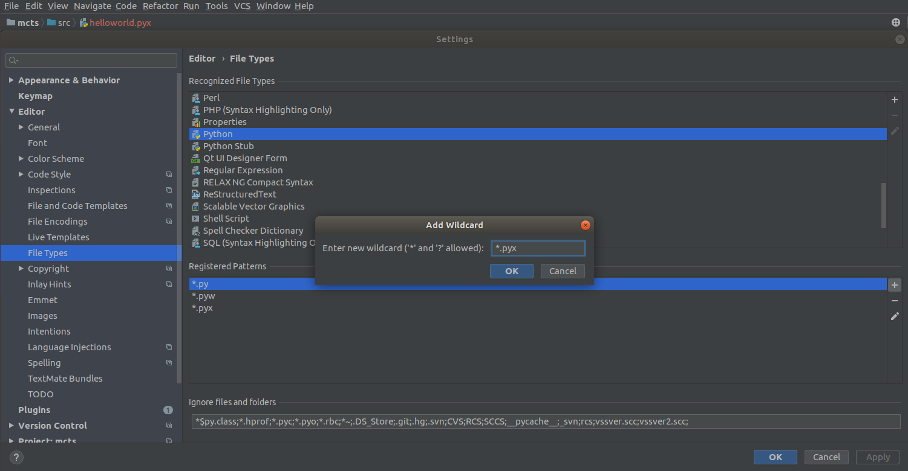
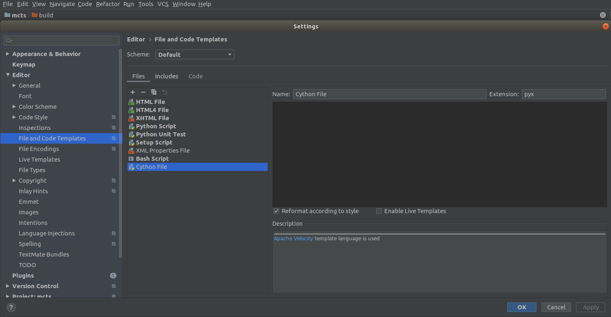
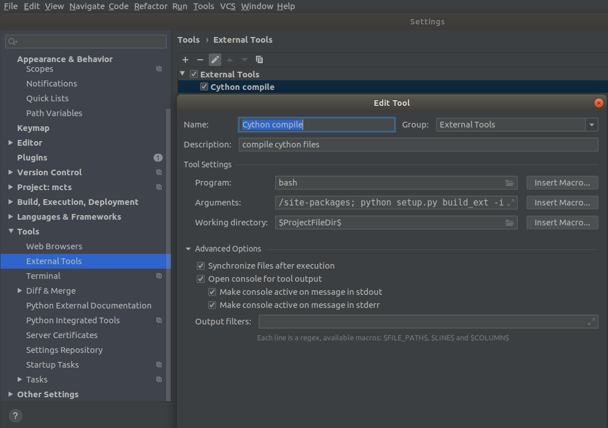
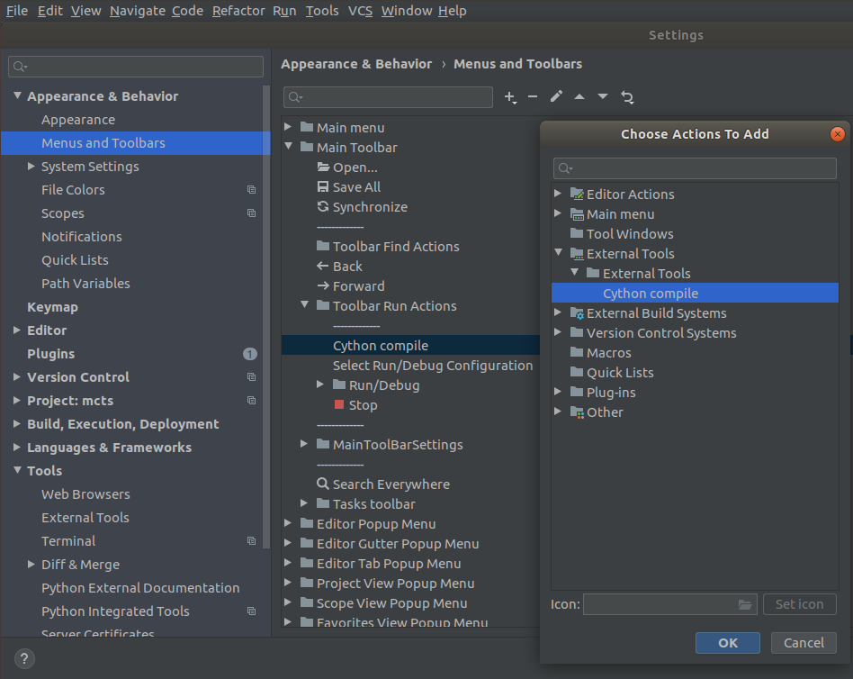

# Cython-setup-for-PyCharm-Community
The community edition unfortunately does not enjoy the same support as the commercial versions. With some configuration though, the community version is able to handle cython files just fine. The biggest downside to using this work aroung is not having linting, which supposedly is included into the commercial edition. (I wouldn't know, since I never got the chance to use it.) But then again, as far as I know there is know other linter for cython anways.

## Syntax highlighting and linting
Since I don't know about any cython linters I just use the pure Python linters and ignore syntax errors by unknown keywords (cdef, cimport, etc.). To do this we have to add the cython file extension to the known file extensions of PyCharm Python.

Go to:

**File >> Settings >> Editor >> File Types**

and select Python from the available options. Press the edit button and include the _*.pyx_ pattern. Now all your _*.pyx_ files will be treated like python files. Of course their not. But having our cython files linted like python files is better then no linting. Next, for convenience, we want PyCharm to be able to create _*.pyx_ files.

Go to:

**File >> Settings >> Editor >> File and Code Templates**

Add a new template and call it Cython File (or anything that suits you). Set the extension to pyx and PyCharm will now offer `Cython File` as an option whenever you use **File >> New** or **Right-Click >> new** in the Project-tab. If you want to you can fill you new cython files with template code as well.

## Building cython files

Building the cython files is somewhat of a riddle to me. I'm not quite sure yet where to put all the different files. But the Cython doc as far as I know says that, if you ever want to package your project, then the generated c files should be included so that a potential user does not have to recompile those. Therefore I will go with the _--inplace_ option for now until I can think of something better. To have an easy time building your cython files you need a good setup.py. The setup.py I provided will do the job for you, if necessary. Just place it next to your src folder and change the src variable to whatever your source is called. You can then call "setup.py" with:

`python setup.py build_ext -i`

For convenience we can create a button in PyCharm to do that for us.

Go to:

**File >> Settings >> External Tools**

Add a new tool and give it a name and maybe a description. You can also cross thos boxes in advanced option if you want to. Finally, include the command into the Tool settings area. Unfortunately, the following setting does not work for me, because python does not know cython. I suspect that it calls the default python and not the project python, which is in a conda environment.

| | |
| --- | --- |
| Program: |		python |
| Arguments: |		setup.py build_ext -i |
| Working directory: |	$ProjectFileDir$ |

Replacing python with $PyInterpreterDirectory$ yields a permission error and I have not found the reason for it yet. If this works four you then you are done with this part and can try to create a button in PyCharm, otherwise you can try the following.

| | |
| --- | --- |
| Program: | 		bash |
| Arguments: |		`-c "export C_INCLUDE_PATH=$PyInterpreterDirectory$/../include/python3.7m; export PYTHONPATH=$PyInterpreterDirectory$/../lib/python3.7/site-packages; python setup.py build_ext -i"` |
| Working directory: |	$ProjectFileDir$ |

The _C_INCLUDE_PATH_ includes Python.h so cython can do it's thing and _PYTHONPATH_ includes the packages in conda env so python can do it's thing. I hope that I did not miss anything, but it might be, that complicated cython files with a lot of imports won't work with this set up. In that case you can still call your setup.py manually.

If you got your external tool working, you can call it with:

**Tools >> External Tools >> _name of your tool_**

In my case: _Cython_ compile. But you can also create a button next to your run button.

Go to:

**File >> Settings >> Appearance & Behavior >> Menus and Toolbars**

Then select _Main Toolbar_ and there _Tooolbar Run Actions_. You can put your button anywhere of course, but I like mine next to the run buttons. You can then add an action and select your External tool.

